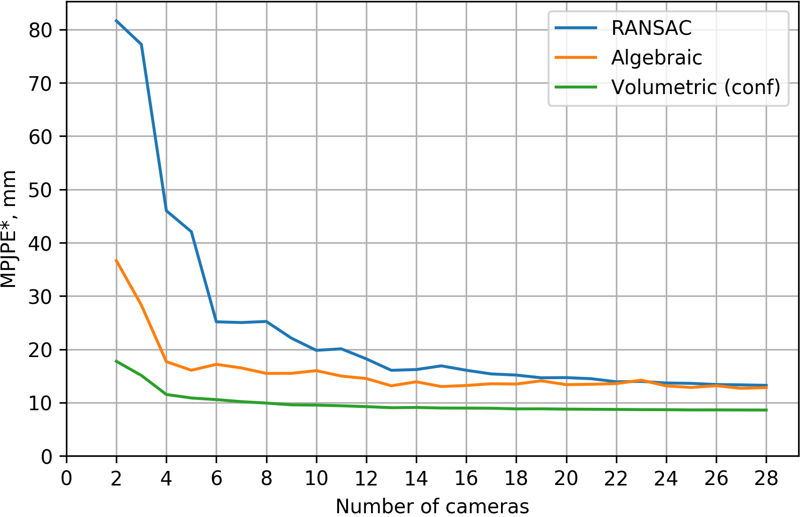
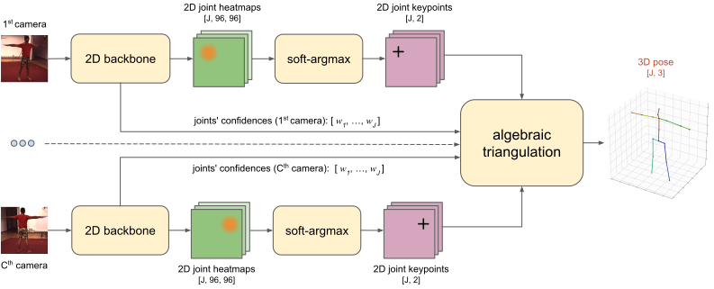
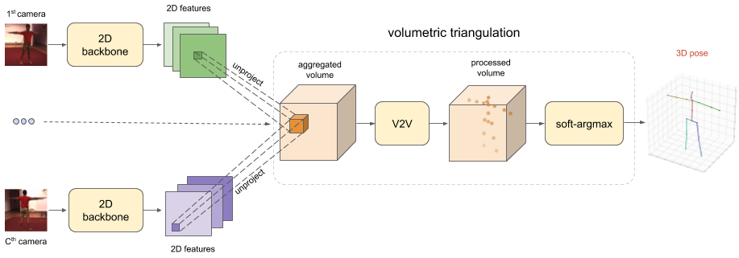

# Abstract
We present two novel solutions for multi-view 3D human pose estimation based on new learnable triangulation methods that combine 3D information from multiple 2D views.

The [first (baseline) solution](#algebraic) is a basic differentiable algebraic triangulation with an addition of confidence weights estimated from the input images.
[The second](#volumetric), more complex, solution is based on [volumetric aggregation](#unprojection) of 2D feature maps from the 2D backbone followed by refinement via 3D convolutions that produce final 3D joint heatmaps.

Crucially, both of the approaches are end-to-end differentiable, which allows us to directly optimize the target metric. We demonstrate [transferability](#transfer-from-panoptic-cmu-to-human36m) of the solutions across datasets and [considerably improve](#human3-6m) the multi-view state of the art on the Human3.6M dataset.

<div class="youtube-responsive-container">
  <iframe width="560" height="315" src="https://www.youtube.com/embed/z3f3aPSuhqg?controls=1" frameborder="0" allow="accelerometer; autoplay; encrypted-media; gyroscope; picture-in-picture" allowfullscreen></iframe>
</div>

# Results
* We conduct experiments on two available large multi-view datasets: Human3.6M [\[2\]](#references) and CMU Panoptic [\[3\]](#references)
* Main metric is **MPJPE** (Mean Per Joint Position Error) which is L2 distance averaged over all joints

**Note**: Here and further we report only summary of our results. Please refer to our paper [cite] for more details.


## Human3.6M
* We surpassed previous [\[5\]](#references) state of the art in **~2.4x** (error relative to pelvis)
* Our best model reaches **17.7 mm** error in absolute coordinates, which is more than enough for real-life applications
* Our [volumetric model](#volumetric) is able to estimate 3D human pose using **any number of cameras**, even **1 camera**. In single-view setup we get results comparable with current state of the art [\[6\]](#references) (49.9 mm vs. 49.6 mm)

### MPJPE relative to pelvis:

|                             	|  MPJPE (averaged across all actions), mm	|
|-----------------------------	|:--------:	|
| Multi-View Martinez [\[4\]](#references)          |   57.0   	|
| Pavlakos et al. [\[8\]](#references)   	          |   56.9   	|
| Tome et al. [\[4\]](#references)                 	|   52.8   	|
| Kadkhodamohammadi & Padoy [\[5\]](#references)   	|   49.1   	|
| RANSAC (our implementation) 	|   27.4   	|
| **Ours, algebraic**          	|   22.6   	|
| **Ours, volumetric**         	| **20.8** 	|

### MPJPE absolute (filtered scenes with non-valid ground-truth annotations):

|                             	|  MPJPE (averaged across all actions), mm 	|
|-----------------------------	|:--------:	|
| RANSAC (our implementation) 	|   22.8   	|
| **Ours, algebraic**          	|   19.2   	|
| **Ours, volumetric**         	| **17.7** 	|

### MPJPE relative to pelvis (single view methods):

|                             	| MPJPE (averaged across all actions), mm 	|
|-----------------------------	|:-----------------------------------:	|
| Martinez et al. [\[7\]](#references)                  	|                 62.9               	|
| Sun et al. [\[6\]](#references)                  	|                 **49.6**                	|
| **Ours, volumetric single view** 	|                 **49.9**                	|

## CMU Panoptic
* Our best model reaches **13.7 mm** error in absolute coordinates for 4 cameras
* We managed to get much smoother and more accurate 3D pose annotations compared to dataset annotations (see video demonstration [cite])
* CMU Panoptic dataset contains ~30 cameras, so we measured quality of our methods in relation to the number of cameras

### MPJPE relative to pelvis [4 cameras]:

|                             	|  MPJPE (averaged across all actions), mm 	|
|-----------------------------	|:--------:	|
| RANSAC (our implementation) 	|   39.5   	|
| **Ours, algebraic**          	|   21.3   	|
| **Ours, volumetric**         	| **13.7** 	|


### Visualization of different approaches [2 cameras]:


This illustration demonstrates the robustness of the volumetric triangulation approach.

### MPJPE* vs. number of cameras:



**Note**: here we measure MPJPE**\***, where noisy annotations from CMU Panoptic are treated as ground truth.


## Transfer from CMU Panoptic to Human3.6M
We demonstrate that the learnt model **is able to transfer** between different coloring and camera setups **without any finetuning** (see video demonstration [cite])


# Models
Our approaches assumes we have synchronized video streams from $$C$$ cameras with known projection matrices $$P_c$$ capturing performance of a single person in the scene. We aim at estimating the global 3D positions $$\boldsymbol{y}_{j,t}$$ of a fixed set of human joints with indices $$j\in(1..J)$$.

## Algebraic
Our first approach is based on algebraic triangulation with learned confidences.



1. 2D backbone produces the joints' heatmaps $$H_{c,j}$$ and camera-joint confidences $$w_{c,j}$$.

2. The 2D positions of the joints $$\boldsymbol{x}_{c,j}$$ are inferred from 2D joint heatmaps $$H_{c,j}$$ by applying soft-argmax (with inverse temperature parameter $$\alpha$$):

    $$
      H'_{c,j} = {\text{exp}(\alpha H_{c,j})} / \Big(\sum_{r_x=1}^{W} \sum_{r_y=1}^{H} \text{exp}(\alpha H_{c,j}(\boldsymbol{r})) \Big)
    $$

    $$
      \boldsymbol{x}_{c,j}= \sum\limits_{r_x=1}^{W}{\sum\limits_{r_y=1}^{H} \boldsymbol{r}\cdot( {H'}_{c,j}(\boldsymbol{r})})
    $$

3. The 2D positions $$\boldsymbol{x}_{c,j}$$ together with the confidences $$w_{c,j}$$ are passed to the algebraic triangulation module which solves triangulation problem in the form of system of weighted linear equations:

    $$
      (\boldsymbol{w}_j\circ{A_j})\tilde{\boldsymbol{y}}_j=0,
    $$

    where $$\boldsymbol{w_j}$$ - vector of confidences for joint $$j$$, $$A_j$$ - matrix combined of 2D joint coordinates and camera parameters (see details in [\[1\]](#references)) and $$\tilde{\boldsymbol{y}}_j$$ - target 3D position of joint $$j$$.

All blocks allow backpropagation of the gradients, so the model can be trained end-to-end.

## Volumetric
Our second approach is based on volumetric triangulation.


<!-- <div style="display: flex; justify-content: center;">
  
</div> -->

1. The 2D backbone produces intermediate feature maps $$M_{c,k}$$ (note, that unlike the first model, feature maps doesn't have to be interpretable).

2. Then feature maps are unprojected into a volume $$V_{c,k}$$ with a per-view aggregation (see animation below):

    $$
      V_c^{\text{proj}}=P_c V^{\text{coords}}
    $$

    $$
      V_{c,k}^{\text{view}}= M_{c,k}\{V_c^{\text{proj}}\},
    $$

    where $$V_c^{\text{coords}}$$ - absolute coordinates of each voxel, $$P_c$$ - projection matrix of camera $$c$$. Operation $$\{\cdot\}$$ denotes bilinear sampling.

3. The volume is passed to a 3D convolutional neural network that outputs the interpretable 3D heatmaps $$V_{j}^{\text{output}}$$.

4. The output 3D positions $$\boldsymbol{y}_{j}$$ of the joints are inferred from 3D joint heatmaps by computing soft-argmax:

$$
  {V'}_{j}^{\text{output}}={\text{exp}( {V}_{j}^{\text{output}} )} /
      \Big({\sum\limits_{r_x=1}^{W}{\sum\limits_{r_y=1}^{H} \sum\limits_{r_z=1}^{D} \text{exp}( {V}_{j}^{\text{output}}(\boldsymbol{r})) \Big)}}
$$

$$
  \boldsymbol{y}_{j} = \sum\limits_{r_x=1}^{W} \sum\limits_{r_y=1}^{H} \sum\limits_{r_z=1}^{D} \boldsymbol{r} \cdot {V'}_{j}^{\text{output}}(\boldsymbol{r})
$$

Volumetric model is also fully differentiable and can be trained end-to-end.

### Unprojection
Here's an animation showing how unprojection works for 2 cameras:


# BibTeX
```
TBA
```

# References
* [\[1\]](#references) R. Hartley and A. Zisserman. **Multiple view geometry in computer vision**.
* [\[2\]](#references) C. Ionescu, D. Papava, V. Olaru, and C. Sminchisescu. **Human3.6m: Large scale datasets and predictive methods for 3d human sensing in natural environments**.
* [\[3\]](#references) H. Joo, T. Simon, X. Li, H. Liu, L. Tan, L. Gui, S. Banerjee, T.  S. Godisart, B. Nabbe, I. Matthews, T. Kanade,S. Nobuhara, and Y. Sheikh. **Panoptic studio: A massively multiview system for social interaction capture**.
* [\[4\]](#references) D. Tome, M. Toso, L. Agapito, and C. Russell.  **Rethinking Pose in 3D: Multi-stage Refinement and Recovery for Markerless Motion Capture**.
* [\[5\]](#references) A. Kadkhodamohammadi and N. Padoy. **A generalizable approach for multi-view 3D human pose regression**.
* [\[6\]](#references) X. Sun, B. Xiao, S. Liang, and Y. Wei. **Integral human pose regression**.
* [\[7\]](#references) J. Martinez, R. Hossain, J. Romero, and J. J. Little. **A simple yet effective baseline for 3d human pose estimation**.
* [\[8\]](#references) G. Pavlakos, X. Zhou, K. G. Derpanis, and  K. Daniilidis. **Harvesting multiple views for marker-less 3D human pose annotations**.
